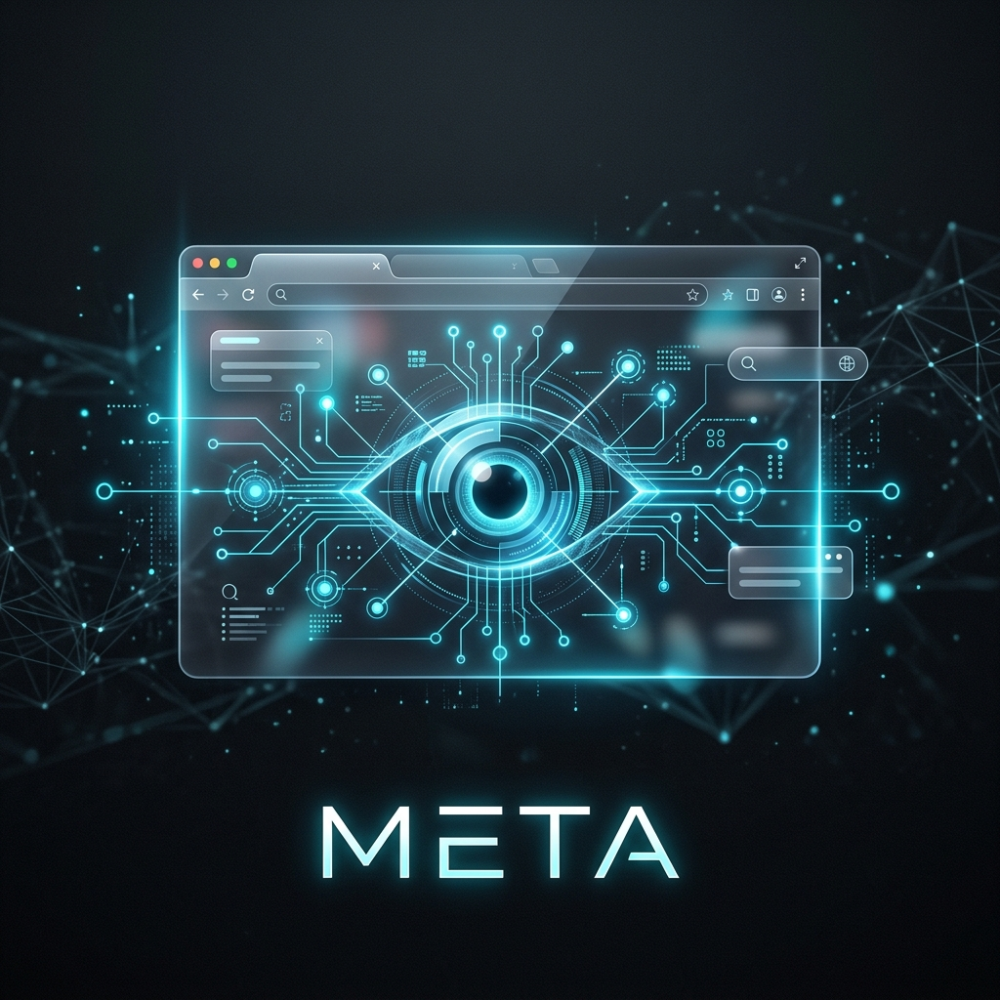
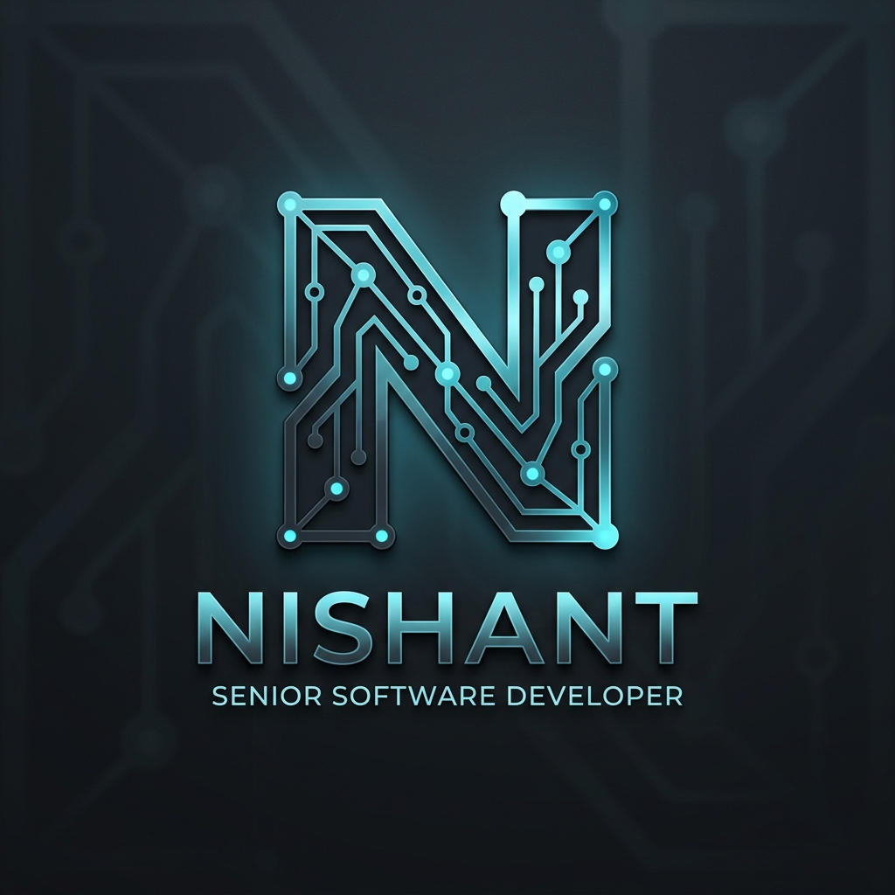

# 🛡️ Nishant | Senior Software Engineer

  

  

  <strong>System Architect • Full-Stack Engineer • AI & Blockchain Specialist</strong>

  
  
  

---

### 🧬 Professional Profile

Senior Developer with a focus on building robust, scalable, and impact-driven software systems. I specialize in bridging the gap between complex backend architectures and intuitive user experiences. Currently pioneering autonomous browser-based intelligence and enterprise-grade automation systems.

- **🚀 Current Mission**: Developing **META**, an autonomous agentic framework for web interaction.
- **🏗️ Core Expertise**: Microservices, ERP Automation, Blockchain Protocols, and High-Performance UI Systems.
- **🛠️ Leadership**: Driving technical decisions that prioritize scalability, security, and developer experience.

---

### 🛠️ Technical Ecosystem

  

---

### 📂 Strategic Projects

#### 🌐 META: Autonomous Browser Intelligence
*Architected a high-performance framework for LLM-driven browser task automation.*
- **Impact**: Achieved 94% success rate in complex multi-step workflows.
- **Stack**: Python, OpenAI API, Gradio, OpenEnv Core.

#### 🏫 SVIT Enterprise ERP
*End-to-end automation for large-scale campus management.*
- **Features**: Role-based access control, real-time analytics, automated reporting.
- **Architecture**: Distributed backend with optimized local storage failovers.

#### 🔗 Vardant Ecosystem
*Full-stack decentralized platform for decentralized commerce interactions.*
- **Focus**: Transparent feedback loops and dynamic UI state management.

---

### 📊 Performance Metrics

  
  

  

---

### 📈 Future Roadmap

- [ ] **Advanced VLM Integration**: Moving from text-based to pixel-based reasoning for web agents.
- [ ] **DeFi Infrastructure**: Scaling decentralized finance protocols for mass adoption.
- [ ] **Technical Mentorship**: Contributing to OSS and shaping the next generation of engineers.

---

### 🌐 Let's Connect

  
  
  

  "Engineering is not just about writing code; it's about solving problems that matter."

  

