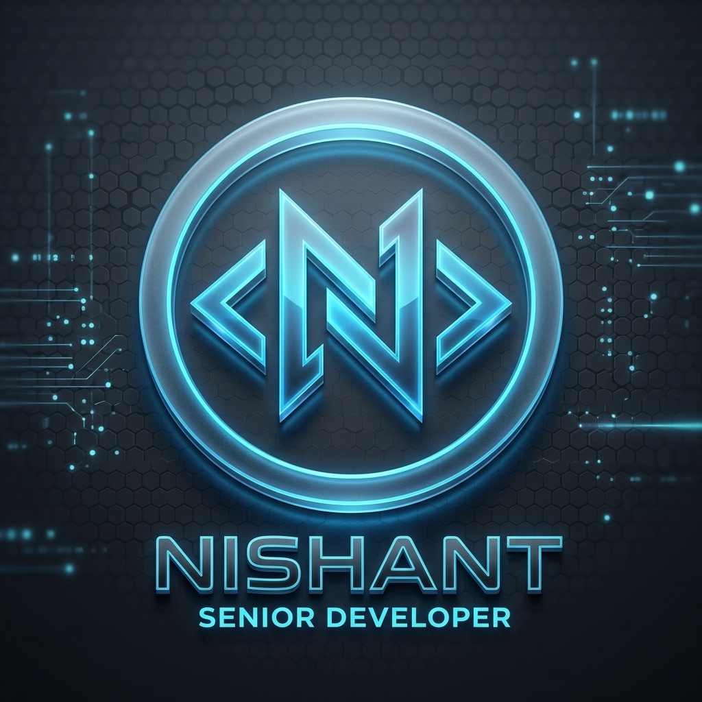

# 

  
  

---

  
  <h2>🚀 Senior Software Engineer & System Architect</h2>
  
  Developing high-performance software at the intersection of **Autonomous Intelligence**, **Blockchain Protocols**, and **Distributed Systems**.
  
  - 🛠️ **Hacking on**: [META](https://github.com/nishant020208/META) - Autonomous Browser Intelligence.
  - 🏗️ **Core**: Microservices, ERP Systems, and Performance Optimization.
  - 🧠 **Focus**: Bridging complex architecture with seamless user experience.

 

  

---

### 🏆 Achievements & Recognition

  

---

### 🛠️ Technical Ecosystem

  

---

### 📊 Strategic Insights

  
  

  

---

### 🔗 Portfolio Highlights

| Project | Description | Tech |
| :--- | :--- | :--- |
| **🌐 META** | Autonomous Browser Task Automation | Python, LLMs, OpenEnv |
| **🏫 SVIT ERP** | Campus Management System | Node.js, PostgreSQL |
| **🔗 Vardant** | Decentralized Commerce Proto | Solidity, React |

---

### 🌐 Let's Connect

  
  
  

  "Engineering is not just about writing code; it's about solving problems that matter."

  

