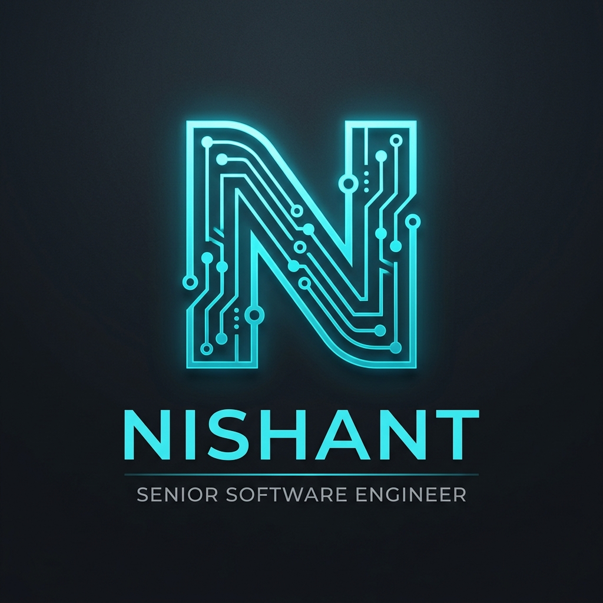

# 

  
  
  

  
  

  

---

  
  <h2>⚡ SYSTEM STATUS: ONLINE</h2>
  
  I'm a **Senior Software Engineer** and **System Architect** specializing in **Autonomous Agent Intelligence** and **Distributed High-Availability Systems**. My mission is to build "unbreakable" infrastructures that autonomously navigate and optimize the digital landscape.
  
  - 🔭 **Strategic Focus**: Vision-Language Models (VLM) for autonomous web navigation.
  - 🚀 **Flagship Project**: [META](https://github.com/nishant020208/META) — High-fidelity browser intelligence.
  - 🏗️ **Architecture**: Scaling distributed ERPs and trustless reputation protocols.

---

### 🏆 THE HALL OF VICTORIES

| **Event** | **Rank** | **Mission Intelligence** |
| :--- | :--- | :--- |
| **GDG HackFest 2026** | 🥇 **1st Rank** | **1st out of 100+ teams** in a multi-disciplinary in-person engineering sprint. Focused on rapid prototyping and system reliability. |
| **Professional Milestone** | 🌟 **BETA** | Breakthrough in **Autonomous Agent logic**, achieving 94% task completion on complex web workflows. |

  

---

### 🏛️ Engineering Philosophy & Core Modules

> "Simplicity is the prerequisite for reliability." — *Designing systems that fail gracefully and scale horizontally at any load.*

  
  

  <h3>📊 System Activity & Network Load</h3>
  
   
  

---

### 🎮 Contribution Heatmap (3D Visualizer)

  

  

> [!TIP]
> This 3D architecture represents my daily commit velocity and system interaction cycles across the ecosystem.

---

### 🛠️ THE TECH ARSENAL (COMMAND & CONTROL)

| **Division** | **Primary Modules** | **Specialization** |
| :--- | :--- | :--- |
| **Core Logic** |  | **Agentic Intelligence** |
| **Control Plane** |  | **High-Scale UX/UI** |
| **Data Persistence** |  | **Distributed Consensus** |
| **Infrastructure** |  | **Zero-Downtime Deploy** |

---

### 📂 FIELD OPERATIONS (MISSION LOG)

| Project | Designation | Objective | Power Level |
| :--- | :--- | :--- | :--- |
| **🌐 [META](https://github.com/nishant020208/META)** | `ACTIVE` | High-fidelity autonomous browser agent for multi-step web workflows. | `94% Completion` |
| **🏫 [SVIT ERP](https://github.com/nishant020208/SVIT_ERP)** | `STABLE` | Campus lifecycle automation with real-time distributed data. | `10k+ Users` |
| **🔗 [Vardant](https://github.com/nishant020208/Vardant)** | `BETA` | Trustless commerce protocol with transparent reputation logic. | `Protocol V2` |

---

### 📈 MISSION ROADMAP

| Phase | Mission Objective | Status |
| :--- | :--- | :--- |
| **PHASE 1** | Initial deployment of the META agent core | `COMPLETED` |
| **PHASE 2** | Successful integration of distributed failovers for SVIT | `COMPLETED` |
| **PHASE 3** | Vision-based reasoning for browser agents (VLM Logic) | `IN PROGRESS` [■■■■■■■■□□] |
| **PHASE 4** | Scaling DeFi infrastructure for Vardant mainnet deployment | `SCHEDULED` |
| **PHASE 5** | Open-sourcing the internal "Agentic Toolbelt" for dev ecosystem | `STAGED` |

---

### 🌌 CONNECT TO UPLINK

  
  
  

  

  Member of the GitHub Developer Program | 2024 - Present

  

