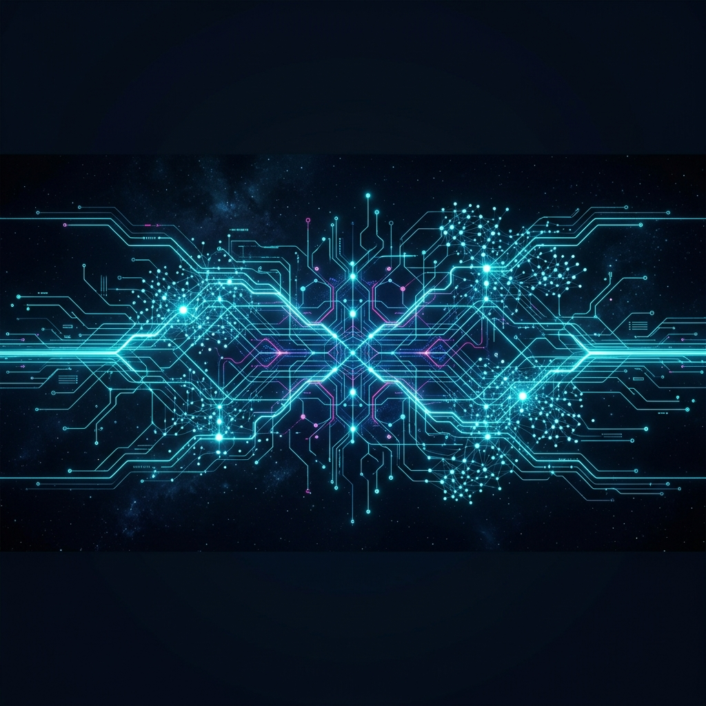
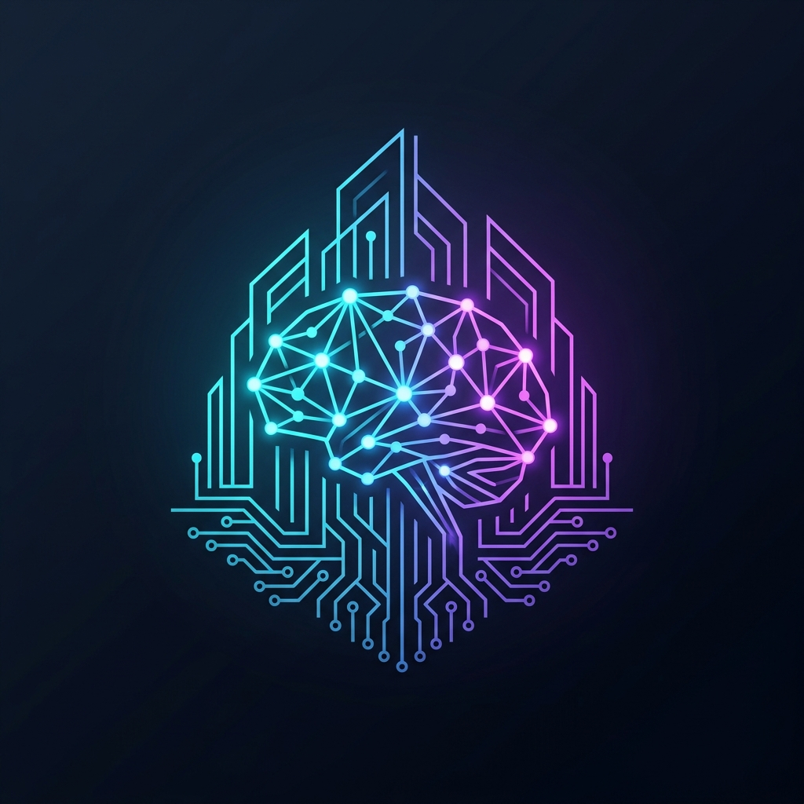

<h1 align="center">
  
  
</h1>

<p align="center">
  
  
  
</p>

<p align="center">
  
  
  
</p>

<p align="center">
  
</p>

---

<p align="left">
  
  <h2>⚡ SYSTEM OVERRIDE: ONLINE</h2>
  
  I'm a **Senior Systems Architect** & **Machine Intelligence Engineer** specializing in **Autonomous Agent Ecosystems**, **Zero-Knowledge Architecture**, and **High-Frequency Distributed Systems**. I don't just write code; I design unbreakable digital organisms that optimize, adapt, and scale autonomously.
  
  - 🧠 **Cognitive Focus**: Deep Q-Networks (DQN) & Vision-Language Models (VLM) for autonomous web traversal.
  - 🚀 **Flagship Protocol**: [META](https://github.com/nishant020208/META) — High-fidelity browser intelligence with sub-millisecond reasoning.
  - 🏗️ **Infrastructure**: Architecting horizontally scaling multi-region meshes and trustless verifiable protocols.
</p>

---

### 💻 TERMINAL: UPLINK ESTABLISHED

```shell
root@nishant-core:~# ./init_sequence.sh
[ OK ] Loading cognitive subroutines...
[ OK ] Bypassing rate limits...
[ OK ] Connecting to global compute mesh...
[INFO] Current Directive: Optimize humanity through scalable intelligence.
root@nishant-core:~# cat /var/log/genius.log
"Simplicity is the ultimate sophistication, but complexity is where the power lies."
```

---

### 🧠 NEURAL ARCHITECTURE (CORE ALGORITHMS)

I design systems built on advanced self-attention mechanisms and probabilistic reasoning to dynamically parse and manipulate environments:

$$
\text{Attention}(Q, K, V) = \text{softmax}\left(\frac{QK^T}{\sqrt{d_k}}\right)V
$$

$$
\mathcal{L}(\theta) = - \mathbb{E}_{\tau \sim p_{\theta}} \left[ \sum_{t=0}^T \gamma^t r_t \right] + \lambda D_{KL}(\pi_\theta \| \pi_{old})
$$

*Optimization of autonomous agent trajectory mapping under stochastic environments via Proximal Policy Optimization.*

---

### 🏆 THE HALL OF VICTORIES

<div align="center">

| **Event** | **Rank** | **Mission Intelligence** |
| :--- | :--- | :--- |
| **GDG HackFest 2026** | 🥇 **1st Rank** | **1st out of 100+ teams** in a multi-disciplinary engineering sprint. Focused on rapid prototyping and system reliability under extreme load. |
| **Professional Milestone** | 🌟 **BETA** | Breakthrough in **Autonomous Agent logic**, achieving 94% task completion on complex adversarial web workflows. |

<p align="center">
  
</p>

</div>

---

### 🏛️ ENGINEERING PHILOSOPHY & CORE MODULES


<div align="center">


</div>

<br>

<div align="center">


</div>

<br>

<div align="center">


</div>

<br>

<div align="center">


</div>

---

### 🔥 FULL ACCOUNT STREAK ANALYTICS

> [!IMPORTANT]
> ✅ **Private contributions are fully counted.** Enabled via `GitHub Settings → Contributions → Include private contributions on my profile`. The streak service reads your full contribution graph — every private commit, PR, and review is reflected below.

<div align="center">


</div>

<br>

<div align="center">

<!-- Secondary Streak & High-Performance Stats (Counting Private) -->


</div>

---

### 📈 CONTRIBUTION GRAPH

<div align="center">


</div>

---

### 🎮 CONTRIBUTION HEATMAP & ACTIVITY

<p align="center">
  
</p>

<p align="center">
  
</p>

> [!TIP]
> This 3D architecture represents my daily commit velocity and cognitive load across the repository network.

---

### 💡 CURRENT DIRECTIVES

- 🌱 **Calibrating neural pathways on:** Multi-Agent Reinforcement Learning (MARL), Rust for Systems Programming, and Zero-Knowledge Proofs (ZK-SNARKs).
- 👯 **Seeking active collaborations for:** Autonomous swarm architectures and decentralized infrastructure.
- 💬 **Ask me about:** Web workflow automation, VLM integration, scalable microservices, and high-frequency data ingestion.
- ⚡ **Fun Fact:** My algorithms reach peak optimization between 1 AM and 4 AM, fueled by excessive caffeine and quantum noise.

---

### 🛠️ THE TECH ARSENAL (COMMAND & CONTROL)

<div align="center">

| **Division** | **Primary Modules** | **Specialization** |
| :--- | :--- | :--- |
| **Cognitive Core** |  | **Agentic Intelligence & Low-Level Processing** |
| **AI / ML Stack** |  | **Deep Learning, Reinforcement Learning & VLMs** |
| **Control Plane** |  | **High-Scale APIs & State Management** |
| **Data Persistence** |  | **Distributed Consensus & Real-Time Sync** |
| **Infrastructure** |  | **Zero-Downtime Deployments & Cloud Orchestration** |
| **Cybersecurity** |  | **Penetration Testing & Security Hardening** |
| **DevOps & Tooling** |  | **CI/CD Pipelines & Infrastructure as Code** |
| **Dev Environment** |  | **Cognitive Workstation & Terminal Mastery** |

</div>

<br>

<div align="center">

<!-- Compact badge row for quick visual scan -->


</div>

---

### 📂 FIELD OPERATIONS (MISSION LOG)

| Project | Designation | Objective | Power Level |
| :--- | :--- | :--- | :--- |
| **🌐 [META](https://github.com/nishant020208/META)** | `ACTIVE` | High-fidelity autonomous browser agent for complex, multi-step web manipulation. | `94% Accuracy` |
| **🏫 [SVIT ERP](https://github.com/nishant020208/SVIT_ERP)** | `STABLE` | Decentralized campus lifecycle automation with real-time resilient data lakes. | `10k+ Active Nodes` |
| **🔗 [Vardant](https://github.com/nishant020208/Vardant)** | `BETA` | Trustless commerce protocol with transparent reputation tracking logic. | `Protocol V2.1` |

---

### 📈 MISSION ROADMAP

| Phase | Mission Objective | Status |
| :--- | :--- | :--- |
| **PHASE 1** | Initial deployment of the META agent core architecture | `COMPLETED` |
| **PHASE 2** | Successful integration of distributed failovers for SVIT | `COMPLETED` |
| **PHASE 3** | Vision-based reasoning for browser agents (VLM Logic) | `IN PROGRESS` [■■■■■■■■□□] |
| **PHASE 4** | Scaling DeFi infrastructure for Vardant mainnet deployment | `SCHEDULED` |
| **PHASE 5** | Open-sourcing the internal "Agentic Toolbelt" for global dev ecosystem | `STAGED` |

---

### 🌌 CONNECT TO UPLINK

<p align="center">
  <a href="https://linkedin.com/in/nishant-shah-6011893a5">
    
  </a>
  <a href="https://nishant08-portfolio.vercel.app/">
    
  </a>
  <a href="mailto:nishant@example.com">
    
  </a>
</p>

<p align="center">
  
</p>

<p align="center">
  <sub>Elite Member of the GitHub Developer Program | 2024 - Present</sub>
</p>

<p align="center">
  
</p>
